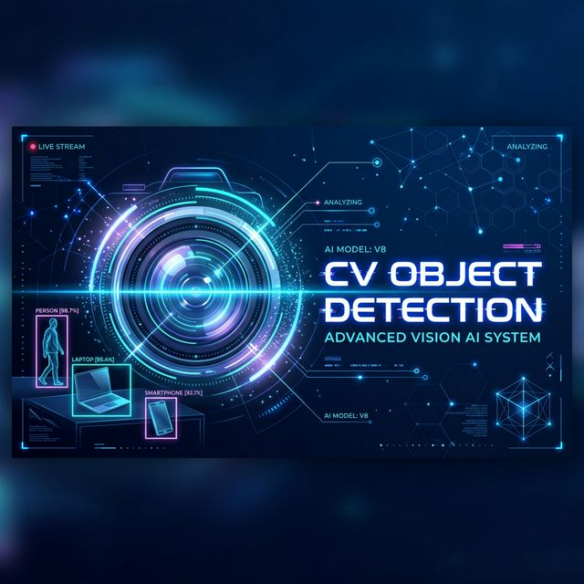

# 👁️ CV Object Detection 🚀

[](https://www.python.org/)
[](https://github.com/ultralytics/ultralytics)
[](https://opencv.org/)

A premium, real-time object detection system powered by the latest **YOLO (You Only Look Once)** architectures. This project supports a wide range of models, from the balanced **YOLO11** to the ultra-fast **YOLO26**, including open-vocabulary detection via **YOLO-World**.



## ✨ Key Features

- 🏎️ **Real-time Performance**: High-FPS detection from webcam feeds (Default: 1280x720).
- 🧠 **Multi-Model Support**: Seamlessly switch between YOLO11, YOLO26, and YOLO-World.
- 🌍 **Open-Vocabulary Detection**: Detect custom items (watches, id cards, pens, etc.) without specific training using YOLO-World.
- 📊 **Dynamic FPS Tracking**: Real-time performance monitoring displayed on-screen.
- 🎯 **High Accuracy**: Optimized bounding boxes and confidence labels with sleek visuals.

---

## 🛠️ Supported Models

| Model | Best For | Technical Highlight |
| :--- | :--- | :--- |
| **YOLO11** | Balanced Performance | Spatial Attention (C2PSA) for complex scenes. |
| **YOLO26** | Edge Computing | NMS-free architecture, 43% faster on CPUs. |
| **YOLO-World** | Custom Objects | Detects anything from mobile phones to lanyards. |

> [!TIP]
> Use **YOLO26** for running on low-power devices like Raspberry Pi or standard laptop CPUs where speed is critical.

---

## 📦 Installation

1. **Clone the repository**:
   ```bash
   git clone <repository-url>
   cd "c v object detection"
   ```

2. **Install dependencies**:
   ```bash
   pip install ultralytics opencv-python numpy torch
   ```

---

## 🚀 Getting Started

Launch the detection session by running:
```bash
python "object detection.py"
```

### Switching Models
Modify the `model_file` variable in `object detection.py`:

```python
# Options: "yolo26n.pt", "yolo11s.pt", "yolov8s-world.pt"
model_file = "yolo26n.pt" 
```

---

## 🔍 Detection Classes
The project tracks a vast array of objects, especially when using the **YOLO-World** model:
- **Personal**: Person, Face, Spectacles, Wristwatch, Backpack.
- **Electronics**: Laptop, Smartphone, Tablet, Projector.
- **Classroom**: Whiteboard, Desk, Chair, Stapler, Pen.
- **Misc**: Bicycle, Scooter, Helmet, Water Bottle.

---

## 📄 License
This project is licensed under the MIT License - see the [LICENSE](LICENSE) file for details.

---
*Built with ❤️ for High-Performance Computer Vision.*
